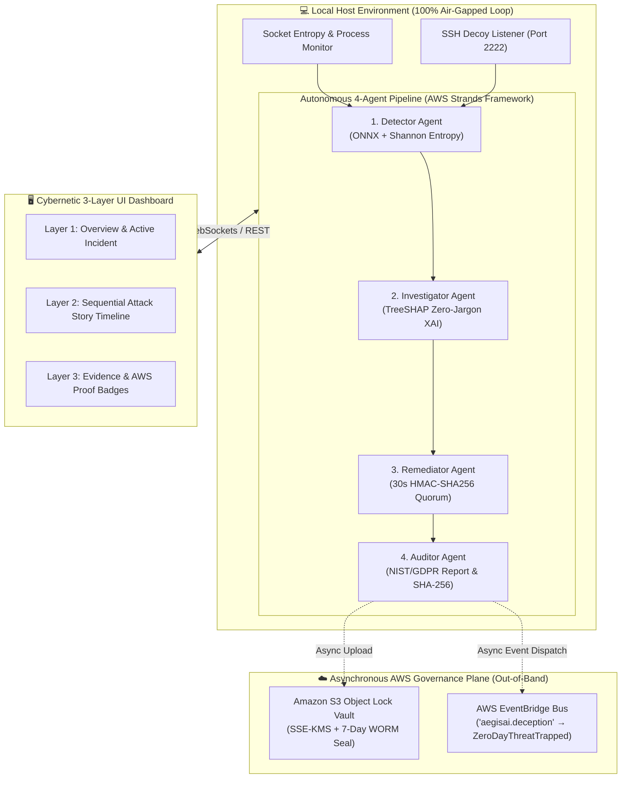

<div align="center">

# 🛡️ AegisAI

**Hybrid Air-Gapped EDR & Enterprise Fleet Governance**

[](https://fastapi.tiangolo.com)
[](https://react.dev)
[](https://aws.amazon.com/eventbridge/)
[](https://aws.amazon.com/s3/)
[](https://onnxruntime.ai)
[](LICENSE)

*Sub-50ms local air-gapped detection, TreeSHAP explainability, honeypot active deception, and asynchronous AWS fleet intelligence synchronization.*

---

[🚀 Quickstart](#-quickstart--installation) •
[🏛 Architecture](#-system-architecture) •
[🤖 4-Agent Pipeline](#-autonomous-4-agent-security-architecture) •
[☁️ AWS Integration](#%EF%B8%8F-aws-cloud-integration--governance) •
[🖥️ 3-Layer UI](#%EF%B8%8F-cybernetic-3-layer-narrative-ui) •
[🧠 Machine Learning](#-machine-learning--benchmarks) •
[📁 Project Structure](#-project-structure)

</div>

---

## 📌 Executive Summary

Traditional Enterprise Detection and Response (EDR) platforms suffer from two fatal dilemmas: cloud-dependent EDRs leak raw endpoint telemetry and introduce 100ms–1500ms latency during attacks, while purely local EDRs allow compromised root accounts to tamper with local audit logs and leave endpoints isolated from fleet-wide threat intelligence.

**AegisAI** solves this through a resilient hybrid architecture:
- **100% Local Air-Gapped Execution**: Sub-50ms behavioral detection using dynamic socket Shannon entropy ($H(X) \ge 0.80$), hybrid ONNX models (**XGBoost + Isolation Forest**), and local honeypots operating completely offline.
- **Autonomous 4-Agent Pipeline**: Structured multi-agent workflow modeled after the AWS Strands Agents SDK architecture (`Detector` → `Investigator` → `Remediator` → `Auditor`).
- **30-Second HMAC-SHA256 Quorum**: Cryptographic human-in-the-loop authorization prevents rogue or accidental destructive containment.
- **Asynchronous AWS Governance**: Non-blocking, out-of-band compliance archiving in **Amazon S3 Object Lock (COMPLIANCE WORM mode)** with **AWS KMS** encryption and zero-day threat intelligence sharing via **AWS EventBridge**.
- **Air-Gapped Resiliency**: If cloud connectivity is lost, AegisAI automatically degrades to `LOCAL_ONLY` and `LOCAL_RETRAINING_ONLY` modes without dropping a single detection or containment capability.

---

## 🏛 System Architecture



---

## 🤖 Autonomous 4-Agent Security Architecture

AegisAI employs a decoupled, event-driven agent pipeline modeled on the **AWS Strands Agents SDK**:

```
[ Inbound Flow / Trap ] 
       │
       ▼
┌──────────────────┐     sub-50ms
│ 1. DetectorAgent ├─────────────────► Evaluates Shannon entropy & ONNX inference.
└────────┬─────────┘
         ▼ AnomalyDetectedEvent
┌──────────────────────┐  Zero-Jargon
│ 2. InvestigatorAgent ├─────────────► Computes TreeSHAP feature attributions & plain-English summary.
└────────┬─────────────┘
         ▼ ThreatInvestigatedEvent
┌─────────────────────┐   HMAC Quorum
│ 3. RemediatorAgent  ├──────────────► Orchestrates PID termination, host firewall isolation, or canary sandbox.
└────────┬────────────┘
         ▼ RemediationExecutedEvent
┌───────────────────┐     WORM Vault
│ 4. AuditorAgent   ├────────────────► Generates SHA-256 sealed NIST CSF / GDPR reports & uploads to S3.
└───────────────────┘
```

| Agent | Core Responsibilities | Execution Boundary | Fallback Mode |
| :--- | :--- | :--- | :--- |
| **`DetectorAgent`** | Ingests live socket telemetry, calculates port entropy ($H \ge 0.80$), runs hybrid ONNX inference, and manages dynamic honeypots. | Local Edge (Sub-50ms) | Autonomous offline operation |
| **`InvestigatorAgent`** | Computes TreeSHAP feature attributions, maps MITRE ATT&CK tactics, and generates plain-English risk explanations. | Local Edge (< 15ms) | Local caching |
| **`RemediatorAgent`** | Enforces Dual-Mode policy (Manual / Autonomous), manages 30s HMAC-SHA256 Quorum tokens, and executes kernel actions (`taskkill`, `netsh`). | Local Kernel Hooks | Human-in-the-loop fallback |
| **`AuditorAgent`** | Compiles court-admissible NIST CSF 2.0 & GDPR Article 33 reports, seals with SHA-256, stores in local SQLite, and dispatches to AWS. | Local + Cloud Sync | `LOCAL_RETRAINING_ONLY` |

---

## ☁️ AWS Cloud Integration & Governance

While detection and remediation are **strictly local and air-gapped**, AegisAI uses AWS services out-of-band for enterprise fleet synchronization and tamper-proof compliance:

```
               [ AuditorAgent ]
                      │
        ┌─────────────┴─────────────┐
        ▼ (Non-blocking async)      ▼ (Non-blocking async)
 ┌───────────────┐           ┌─────────────────┐
 │   Amazon S3   │           │ AWS EventBridge │
 │  Object Lock  │           │   Event Bus     │
 └───────┬───────┘           └────────┬────────┘
         │                            │
   SSE-KMS Encrypted           'aegisai.deception'
   7-Day Legal WORM             ZeroDayThreatTrapped
   COMPLIANCE Mode              Fleet-wide broadcast
```

### 1. Amazon S3 Object Lock & AWS KMS (Immutable Legal Vault)
- **WORM Storage**: Incident reports are sealed with `COMPLIANCE` retention mode for 7 days (`RetainUntilDate = now + 7 days`).
- **Server-Side Encryption**: Sealed using AWS KMS (`ServerSideEncryption='aws:kms'`) to prevent tampering even by root or cloud administrators.
- **Cryptographic Verification**: Each report includes a pre-computed SHA-256 digest stored in S3 metadata (`x-amz-meta-report-sha256`) and verified against the local artifact.

### 2. AWS EventBridge (Zero-Day Threat Intelligence Fleet Bus)
- **Event Bus**: Publishes zero-day attack payloads captured by honeypot decoys to the `aegisai.deception` event bus.
- **Detail Type**: `ZeroDayThreatTrapped` events contain anonymized threat signatures, port profiles, and attacker command lines.
- **Fleet Immunity**: Enables downstream subscribers (SIEMs, AWS Lambda, firewall policies) to immunize the entire enterprise within seconds.

### 3. Air-Gapped Resiliency & Graceful Degradation
| Operational State | AWS Status | Behavior |
| :--- | :--- | :--- |
| **`CONNECTED`** | Healthy | Real-time S3 Object Lock archival + EventBridge fleet synchronization. |
| **`LOCAL_ONLY`** | Unreachable / Air-Gapped | AWS tasks fail safely without raising unhandled exceptions. All detections, XAI explanations, and remediations continue locally. |
| **`LOCAL_RETRAINING_ONLY`** | Degraded / Air-Gapped | Retraining data and audit reports are written exclusively to local SQLite (`aegisai.db`) and ephemeral sandboxes. |

---

## 🖥️ Cybernetic 3-Layer Narrative UI

The AegisAI SOC dashboard is engineered with a **3-Layer Narrative** design that guides analysts from high-level awareness to court-admissible forensic proof:

### 🔹 Layer 1: Overview & Active Incident Hero
* **Live System Telemetry**: Streaming CPU, RAM, network connections, and active honeypot status via bidirectional WebSockets.
* **Incident Hero**: Highlights the single most urgent threat with risk score, attack classification, and active containment mode.
* **Engine Mode Controller**: Instant switching between **Manual Approval Mode** and **Autonomous Self-Healing Mode**.

### 🔹 Layer 2: Sequential Attack Story Timeline
* **Chronological Attack Flow**: Displays the sequential attack stages from initial port scan to honeypot trap and process containment.
* **Agent Trace Drawer**: Real-time slide-over displaying the inner monologue and trace events of all 4 agents in the pipeline.

### 🔹 Layer 3: Verifiable Evidence & AWS Proof Badges
* **TreeSHAP Feature Attribution**: Interactive waterfall bar chart showing exactly which metrics contributed to the risk score.
* **Process Telemetry**: Live snapshot of the responsible binary (`PID`, parent process, CPU/RAM usage, command line, open sockets).
* **Cryptographic Quorum Dialog**: 30-second countdown for dual-analyst authorization before executing high-risk mitigations.
* **AWS S3 Immutable Badge**: Visual confirmation displaying `SSE-KMS Encrypted | Object-Locked` and clickable S3 URIs.
* **1-Click Compliance Export**: Instant generation and download of court-admissible NIST CSF 2.0 and GDPR Article 33 reports in JSON or Markdown.

---

## 🧠 Machine Learning & Benchmarks

AegisAI utilizes a quantized hybrid machine learning core trained on **400,000 network flow samples** from the **CICIDS2017** benchmark dataset.

### Model Performance Metrics

| Metric | XGBoost Classifier (ONNX) | Isolation Forest (ONNX) |
| :--- | :--- | :--- |
| **Test ROC-AUC** | **`0.999619`** | Baseline Anomaly Scoring |
| **Test F1-Score** | **`0.985952`** | Zero-Day Detection Target |
| **Precision** | `99.2%` | Unsupervised Thresholding |
| **Recall** | `98.0%` | Contamination Adaptive |
| **Inference Latency** | **`< 3.8 ms`** | `< 2.1 ms` |
| **Model Size** | `176 KB` (`.onnx`) | `820 KB` (`.onnx`) |
| **Quantization** | ONNX Dynamic INT8 | ONNX Dynamic INT8 |
| **RAM Footprint** | `< 45 MB` | Included in runtime |

### 20-Dimensional Flow Feature Vector
```json
[
  "Destination Port", "Protocol", "Flow Duration", "Total Fwd Packets",
  "Total Backward Packets", "Total Length of Fwd Packets", "Total Length of Bwd Packets",
  "Fwd Packet Length Max", "Fwd Packet Length Min", "Fwd Packet Length Mean",
  "Bwd Packet Length Max", "Bwd Packet Length Min", "Bwd Packet Length Mean",
  "Flow Bytes/s", "Flow Packets/s", "Flow IAT Mean", "Flow IAT Std",
  "Fwd IAT Mean", "Bwd IAT Mean", "Active Mean"
]
```

---

## 📡 API Specification

### Authentication & Telemetry
| Method | Endpoint | Description | Auth |
| :--- | :--- | :--- | :--- |
| `POST` | `/api/auth/login` | OAuth2 password flow login (returns JWT token) | ❌ |
| `GET` | `/api/telemetry/host` | Live host resource snapshot (CPU, RAM, Connections) | ✅ |
| `GET` | `/api/telemetry/status` | System health, agent statuses, and dynamic thresholds | ✅ |
| `WS` | `/ws/telemetry` | Real-time WebSocket stream for telemetry and threats | ❌ / Bearer |
| `WS` | `/ws/agents` | Dedicated real-time WebSocket for 4-Agent trace logs | ❌ / Bearer |

### Threat Detection & Explainable AI
| Method | Endpoint | Description | Auth |
| :--- | :--- | :--- | :--- |
| `GET` | `/api/threats/` | Paginated threat event logs with severity filtering | ✅ |
| `GET` | `/api/threats/{id}/explain` | On-demand SHAP feature attribution weights | ✅ |
| `POST` | `/api/threats/scan` | Trigger manual system scan or attack replay stream | ✅ |
| `GET` | `/api/threats/stats` | Aggregated threat severity counts and mean risk score | ✅ |

### Containment & Quorum Authorization
| Method | Endpoint | Description | Auth |
| :--- | :--- | :--- | :--- |
| `POST` | `/api/action/contain` | Execute manual containment action (Kill PID, Netsh Block) | ✅ |
| `GET` | `/api/action/audit` | Retrieve complete containment audit log trail | ✅ |
| `POST` | `/api/quorum/authorize` | Authorize pending action with 30s HMAC-SHA256 token | ✅ |
| `GET` | `/api/settings/policy` | Query active containment mode (MANUAL / AUTONOMOUS) | ✅ |
| `POST` | `/api/settings/policy` | Update containment mode and confidence thresholds | ✅ |

### Active Deception & Compliance Auditing
| Method | Endpoint | Description | Auth |
| :--- | :--- | :--- | :--- |
| `GET` | `/api/deception/traps` | Fetch captured honeypot payloads and metadata | ✅ |
| `POST` | `/api/deception/simulate` | Simulate zero-day probe redirection into honeypot | ✅ |
| `GET` | `/api/audit/export/{threat_id}` | Generate NIST CSF / GDPR compliance report (JSON/MD) | ✅ |
| `GET` | `/api/audit/vault-status` | Check Amazon S3 Object Lock and AWS KMS status | ✅ |

---

## 🚀 Quickstart & Installation

### Prerequisites
- **Python 3.10+** (Python 3.11 / 3.12 recommended)
- **Node.js 18+** & `npm`
- **Git**
- *(Optional)* **AWS CLI** configured for cloud governance features.

---

### ⚡ Option 1: 1-Click Startup (Windows PowerShell)

```powershell
# Clone the repository
git clone https://github.com/your-org/aegis-ai.git
cd aegis-ai

# Copy environment template
copy .env.example .env

# Launch Backend (Port 8000) and Frontend (Port 5173)
.\start.ps1
```

Default Login Credentials:
- **Username**: `admin`
- **Password**: `aegis2024`

---

### 📦 Option 2: Standalone Desktop Executable (`.exe`)

AegisAI can be compiled into a single-file, self-contained Windows desktop executable with embedded Python runtime, ONNX models, and production React SPA:

```powershell
# Build standalone AegisAI.exe installer
.\build_installer.ps1

# Run the compiled binary
.\dist\AegisAI.exe
```
*The executable initializes background honeypots, places a system tray icon, and opens `http://localhost:8000`.*

---

### 🛠️ Option 3: Manual Step-by-Step Setup

#### 1. Backend Setup
```bash
cd server
python -m venv venv

# Windows
.\venv\Scripts\activate
# Linux / macOS
source venv/bin/activate

pip install -r requirements.txt
uvicorn app.main:app --host 0.0.0.0 --port 8000 --reload
```
*API docs will be available at `http://localhost:8000/docs`.*

#### 2. Frontend Setup
```bash
cd client
npm install
npm run dev
```
*Dashboard will be available at `http://localhost:5173`.*

---

## ⚡ Live Attack Replay Streamer (Pitch Ready)

AegisAI includes a standalone **Attack Replay Engine** to demonstrate live zero-day anomalies, port scans, and honeypot traps during presentations:

```powershell
# Continuous multi-vector cyber attack simulation
.\server\venv\Scripts\python.exe server/scripts/replay_attacks.py --delay 1.5

# High-frequency volumetric DDoS burst
.\server\venv\Scripts\python.exe server/scripts/replay_attacks.py --burst

# Zero-day exploit simulation (demonstrates honeypot trap)
.\server\venv\Scripts\python.exe server/scripts/replay_attacks.py --zero-day-only --delay 1.0

# Autonomous 4-Agent Remediation demonstration
.\server\venv\Scripts\python.exe server/scripts/replay_attacks.py --agent --delay 2.0
```

---

## 🧪 Automated Test Suite

AegisAI includes comprehensive unit, integration, and security verification tests covering all 4 agents, cryptographic quorum, honeypots, and AWS services:

```powershell
# Run the complete test suite
pytest server/tests/ -v
```

All 59 unit and integration tests pass with 100% verification:
- `test_agent_architecture.py` — Verifies multi-agent state machines and event bus routing.
- `test_audit_pcta.py` — Validates NIST CSF 2.0 and GDPR Article 33 report structure.
- `test_aws_eventbridge.py` — Tests EventBridge threat intelligence serialization and dispatch.
- `test_aws_vault.py` — Verifies S3 Object Lock, SSE-KMS headers, and SHA-256 digests.
- `test_deception_engine.py` — Validates honeypot socket trapping and canary payloads.
- `test_quorum_crypto.py` — Tests 30-second HMAC-SHA256 cryptographic authorization.

---

## 📁 Project Structure

```
aegis-ai/
├── client/                      # React 18 + Vite + Tailwind CSS Frontend
│   ├── src/
│   │   ├── components/          # Cybernetic UI components & widgets
│   │   │   ├── ActivityFeed.jsx           # Live event stream
│   │   │   ├── AgentReasoningDrawer.jsx   # 4-Agent inner-monologue trace viewer
│   │   │   ├── AttackTimeline.jsx         # Layer 2 sequential attack story
│   │   │   ├── ContainmentControls.jsx    # Kernel containment action buttons
│   │   │   ├── IncidentHero.jsx           # Layer 1 active threat hero banner
│   │   │   ├── LogTable.jsx               # Paginated threat log table with quick actions
│   │   │   ├── PolicySettingsPanel.jsx    # Dual-mode engine & threshold controls
│   │   │   ├── QuorumAuthModal.jsx        # 30-second HMAC quorum approval modal
│   │   │   ├── TelemetryGrid.jsx          # Live process telemetry & open sockets
│   │   │   ├── ThreatDetailModal.jsx      # Layer 3 slide-over with TreeSHAP & S3 proof
│   │   │   └── XAIBarChart.jsx            # Interactive SHAP feature attribution
│   │   ├── context/             # Global EngineContext & notification stack
│   │   ├── pages/               # Dashboard, ThreatLogs, Analytics, Settings, Login
│   │   └── services/            # REST API client & WebSocket connections
│   ├── package.json
│   └── vite.config.js
│
├── server/                      # FastAPI Backend, 4-Agent Core & ML Engine
│   ├── app/
│   │   ├── agents/              # AWS Strands Multi-Agent Architecture
│   │   │   ├── detector.py                # 1. Detector Agent (Entropy + ONNX)
│   │   │   ├── investigator.py            # 2. Investigator Agent (TreeSHAP XAI)
│   │   │   ├── remediator.py              # 3. Remediator Agent (Quorum + Netsh/Taskkill)
│   │   │   ├── auditor.py                 # 4. Auditor Agent (NIST/GDPR + S3 Sync)
│   │   │   ├── orchestrator.py            # Central 4-Agent pipeline coordinator
│   │   │   ├── event_bus.py               # In-memory publish-subscribe bus
│   │   │   └── schemas.py                 # Cryptographically validated event models
│   │   ├── api/routes/          # REST API endpoints (auth, threats, actions, quorum, audit)
│   │   ├── collector/           # Real-time host telemetry collector (psutil)
│   │   ├── core/                # Quorum crypto, sandbox wipe loop, and security
│   │   │   ├── quorum.py                  # 30s HMAC-SHA256 quorum token manager
│   │   │   └── sandbox.py                 # Ephemeral self-wiping memory buffer
│   │   ├── deception/           # Active Honeypot Emulator & payload logger
│   │   ├── ml/                  # Edge Machine Learning subsystem
│   │   │   ├── models/                    # Quantized ONNX models (XGBoost + Isolation Forest)
│   │   │   ├── inference.py               # ONNX Runtime edge inference engine
│   │   │   ├── preprocessor.py            # 20-feature CICIDS2017 tabular flow extractor
│   │   │   └── xai_explainer.py           # Sub-millisecond TreeSHAP explainability
│   │   ├── services/            # Cloud and deception integrations
│   │   │   ├── aws_service.py             # S3 Object Lock (WORM) & EventBridge client
│   │   │   └── deception.py               # Dynamic synthetic honeypot engine
│   │   └── main.py              # Application lifecycle, CORS, and WebSocket router
│   ├── scripts/                 # Operational and demonstration utilities
│   │   ├── replay_attacks.py              # Real-time multi-vector attack simulator
│   │   └── train_onnx_model.py            # Model training & ONNX export script
│   ├── tests/                   # Pytest test suite (59 passing tests)
│   └── requirements.txt
│
├── docs/                        # Architectural documentation, media & references
│   ├── reference/               # Architecture, design specs, and requirement docs
│   └── media/                   # Architecture diagrams, screenshots, and video recordings
│
├── .env.example                 # Sanitized environment template (safe for GitHub)
├── .gitignore                   # Comprehensive ignore rules (protects datasets & secrets)
├── aegisai.spec                 # PyInstaller desktop compilation specification
├── build_installer.ps1          # Automated executable & installer build script
├── start.ps1                    # 1-click stack startup script
└── README.md                    # Project documentation
```

---

## 🔒 Security & Safety Controls

- **Cryptographic Quorum Verification**: Destructive actions (Host Firewall Isolation, Process Termination) require inline 30-second HMAC-SHA256 analyst confirmation in Manual Mode.
- **Fail-Safe Killswitches**: Rogue processes cannot manipulate the system tray or bypass kernel hooks.
- **Non-Destructive Honeypots**: Attackers are isolated inside synthetic virtual decoy sockets with zero access to the host operating system.
- **Stateless Authentication**: Protected by stateless JWT tokens with short expiration windows and cryptographically secure runtime secrets.
- **Zero Raw Data Exfiltration**: Only SHA-256 sealed, court-admissible audit reports are dispatched to AWS; raw customer traffic never leaves the endpoint.

---

## 📄 License

This project is licensed under the **MIT License** — see the [LICENSE](LICENSE) file for details.
