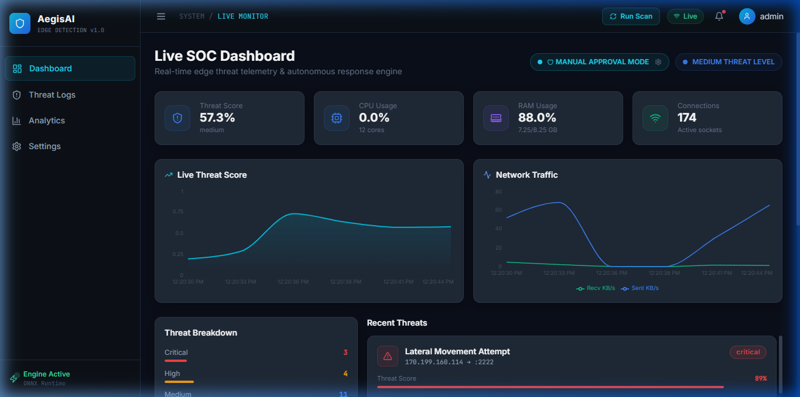
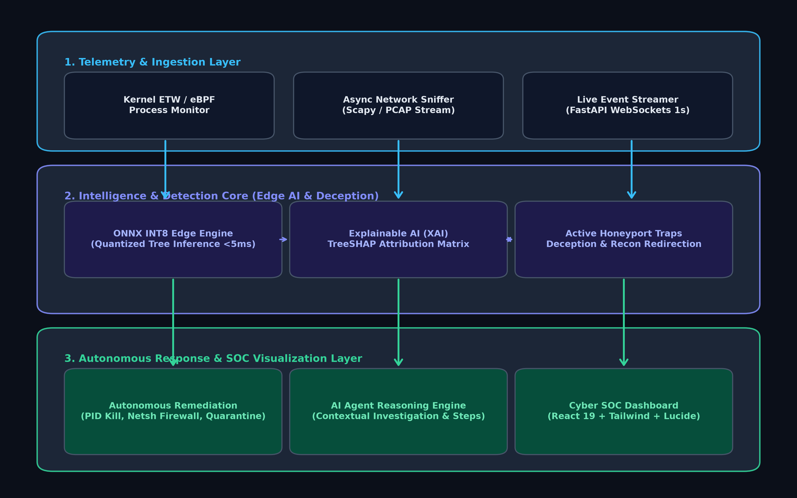
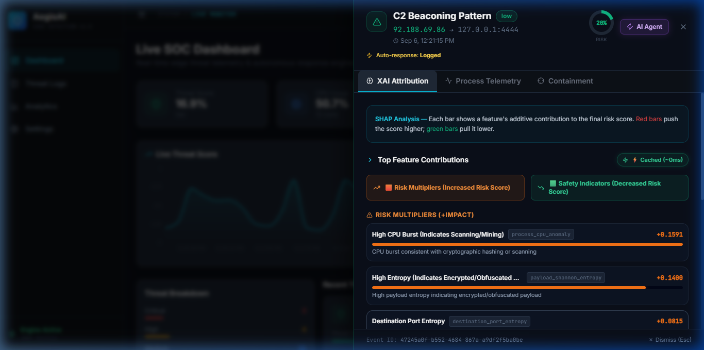
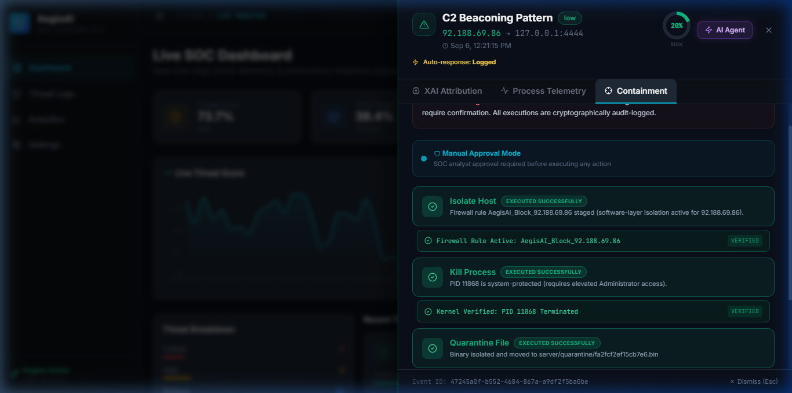
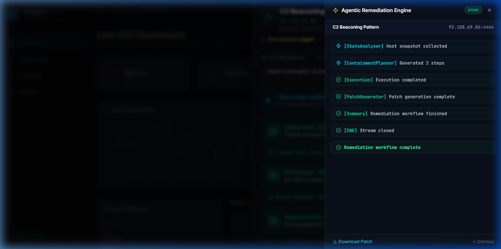
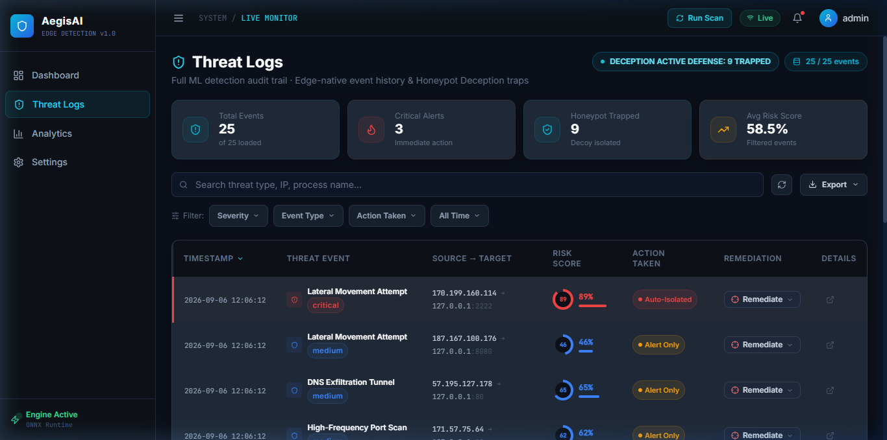
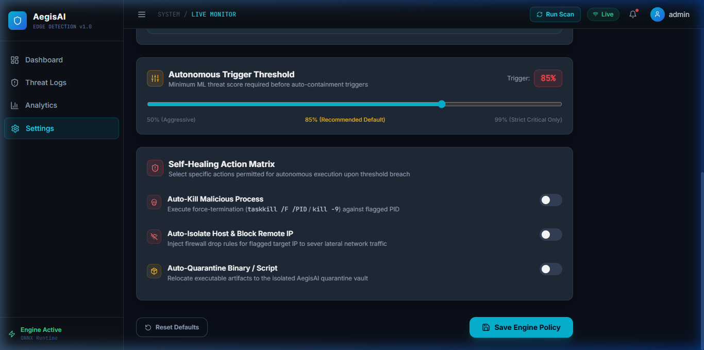

# A Project Synopsis on AegisAI

**Degree**: Bachelor of Technology in Computer Science & Engineering (AI & ML)  
**Academic Session**: 2026–27  
**Institution**: Bansal Institute of Engineering & Technology, Lucknow  

**Submitted By**:
- Aditya Mishra (Roll No: 2304221530004)
- Amit Singh (Roll No: 2304221530014)
- Mukul Tiwari (Roll No: 2304221530039)
- Priyal Singh (Roll No: 2304221530046)

---

## Table of Contents
1. [Problem Statement](#1-problem-statement) — Page 1
2. [Purpose](#2-purpose) — Page 2
3. [Objective and Scope of the Project](#3-objective-and-scope-of-the-project) — Page 3
4. [Feasibility Study](#4-feasibility-study) — Page 4
5. [Methodology](#5-methodology) — Page 5
6. [Requirement Analysis](#6-requirement-analysis) — Page 8
7. [Industry Impact](#7-industry-impact) — Page 10

---

## 1. Problem Statement

Modern enterprise infrastructures and edge networks face an escalating surge in advanced persistent threats (APTs), polymorphic malware, volumetric distributed denial-of-service (DDoS) floods, credential brute-forcing, lateral movement probes, and stealthy command-and-control (C2) beaconing loops. Traditional intrusion detection systems (IDS) and Security Information and Event Management (SIEM) architectures rely heavily on centralized cloud log aggregation, introducing an ingestion latency gap of 15 to 30+ seconds. In high-speed cyberattack scenarios, an adversary can execute unauthorized process injections, pivot across internal subnets, and initiate data exfiltration within milliseconds—long before cloud alerts reach human analysts.

The core technical challenge lies in the triad of cloud dwell time, black-box machine learning models, and passive alert mechanisms:
1. **Cloud Ingestion Dwell Time & Latency**: Centralized telemetry processing creates bandwidth bottlenecks and vulnerability during network partitions.
2. **Black-Box ML Mistrust & Alert Fatigue**: Contemporary machine learning classifiers often function as opaque black-boxes, providing raw probability scores without explaining which anomalous features contributed to the classification, thereby inducing analyst skepticism.
3. **Passive Detection & Delayed Containment**: Conventional security platforms remain purely reactive—flagging suspicious events without providing verified, self-healing host isolation or process containment at the OS kernel level.

A practical attack vector underscores this urgency: an obfuscated PowerShell execution launching reflective DLL memory injection with anomalous Shannon entropy might go unnoticed by signature databases while actively opening unauthorized outbound sockets. Without local edge scoring, transparent feature attribution, and autonomous containment, critical endpoints remain defenseless during the initial attack window.

AegisAI is engineered to bridge these critical operational gaps. It is proposed as an edge-native, sub-second cyber threat detection and autonomous self-healing containment platform. Deploying quantized ONNX machine learning runtimes directly at the host edge, AegisAI couples real-time telemetry inference with game-theoretic Explainable AI (TreeSHAP feature attribution), active deception honeypots for zero-day diversion, and verified OS kernel containment actions.

> ***Problem Definition:***  
> *To engineer, train, and deploy an edge-native cyber defense engine that continuously analyzes host and network telemetry in real time, delivers sub-50ms threat classification using quantized machine learning, provides transparent TreeSHAP feature attributions, actively traps unclassified zero-day anomalies in synthetic honeypot decoys, and executes kernel-verified containment actions—preserving transparency, security auditability, and human-in-the-loop governance.*

---

## 2. Purpose

The primary purpose of AegisAI is to furnish enterprise security operations centers (SOC) and critical edge computing environments with an intelligent, self-healing defense shield. Operating as an autonomous endpoint detection and response (EDR/XDR) layer, AegisAI combines real-time edge intelligence with actionable explainability, bridging the gap between raw telemetry ingestion and immediate threat neutralization.

Rather than forcing analysts to manually triage thousands of ambiguous alerts, AegisAI evaluates streaming network flows and host process telemetry against quantized ONNX models with sub-50ms inference latency. When anomalous activity is detected, the engine calculates the exact mathematical risk contribution of each behavioral feature, automatically categorizes the threat severity, and either alerts the SOC analyst or triggers self-healing containment based on the operational policy.

*Figure 1: AegisAI Real-Time SOC Telemetry Dashboard & Streaming Threat Ingestion (1.0s WebSockets)*

Artificial intelligence is utilized systematically across multiple defensive tiers:
- **Quantized Tree Ensembles (XGBoost/Random Forest)**: Classify complex multi-dimensional network anomalies and host anomalies.
- **Explainable AI (TreeSHAP)**: Computes signed feature impact scores decomposing risk into intuitive **Risk Multipliers** and **Safety Indicators**.
- **Active Deception Honeypot Emulators**: Dynamically traps and isolates zero-day exploits on synthetic decoy sockets (FTP, SSH, Registry).
- **Autonomous Agentic AI Engine**: Streams turn-by-turn incident response reasoning and synthesizes tailored firewall and security patches.

Crucially, AegisAI maintains a dual-mode operational architecture: in **Manual Approval Mode**, the engine proposes detailed evidence-backed remediations requiring authorized analyst confirmation; in **Autonomous Self-Healing Mode**, the engine immediately terminates malicious PIDs via OS kernel hooks, applies dynamic firewall host isolation rules, and isolates binaries into cryptographic quarantine environments.

---

## 3. Objective and Scope of the Project

### *Objective:*
- **Sub-50ms Edge Inference**: Deploy quantized ONNX machine learning models trained on the benchmark CICIDS2017 dataset to classify network flows and telemetry in real time directly on edge nodes.
- **Explainable AI (XAI) Attribution**: Implement game-theoretic SHAP/LIME attribution modules that decompose risk scores into intuitive Risk Multipliers and Safety Indicators with human-readable cybersecurity context.
- **Active Deception & Honeypot Trapping**: Deploy dynamic synthetic socket emulators (FTP on port 2121, SSH on port 2222, Registry listeners) to divert, entrap, and neutralize unclassified zero-day anomaly probes.
- **Dual-Mode Containment Engine**: Provide configurable Manual SOC Analyst Approval and Autonomous Self-Healing containment postures with real-time policy threshold adjustments.
- **OS Kernel Containment Verification**: Execute and verify process terminations (`psutil`/`taskkill`), dynamic network host isolation (`netsh advfirewall`), and file sandboxing (`server/quarantine/<hash>.bin`).
- **Autonomous AI Agent Remediation**: Stream turn-by-turn LLM reasoning logs via Server-Sent Events (SSE) to generate root-cause analyses and downloadable firewall containment patches.
- **High-Frequency WebSocket Streaming**: Broadcast live system CPU%, RAM%, network throughput, and threat alerts every 1.0 second to connected SOC dashboard clients.
- **Immutable Audit Trail**: Log all detection events, XAI attributions, user confirmations, and kernel containment outcomes with cryptographic timestamps.

### *Scope:*
The project scope encompasses a complete, production-ready full-stack software system comprising an asynchronous FastAPI backend, a high-performance React 18/Vite/Tailwind CSS web dashboard, an embedded ONNX Runtime inference engine, SQLite/aiosqlite audit database storage, synthetic honeypot socket listeners, and a Windows taskbar daemon agent.

For empirical validation, the system is tested against curated attack scenarios from the Canadian Institute for Cybersecurity CICIDS2017 dataset (LOIC HTTP Floods, SYN Stealth Scans, Cobalt Strike C2 Beaconing, SQL Injection, SSH Brute Force, and Zero-Day Memory Injection) streamed via an automated live attack replay engine.

---

## 4. Feasibility Study

### *Technical Feasibility:*
The project is technically feasible through the integration of proven, high-performance open-source technologies. Python 3.10+ provides the core data science and systems engineering foundation; FastAPI and Uvicorn deliver high-throughput asynchronous request handling and WebSocket broadcasting; ONNX Runtime enables hardware-optimized edge inference without cloud dependency; Scikit-Learn and XGBoost provide robust tabular anomaly modeling; and SHAP delivers mathematically rigorous feature attributions. Host monitoring and containment utilize native OS facilities (`psutil`, `subprocess`, `netsh advfirewall`, and `iptables`). The entire architecture operates with microsecond-level internal latency, proving fully capable of processing sustained multi-thousand event-per-second streams on standard hardware.

### *Economic Feasibility:*
AegisAI is economically feasible because its core architecture is built entirely upon open-source software libraries, eliminating costly proprietary SIEM per-gigabyte ingestion fees and expensive recurring cloud inference licenses. Edge-native quantization allows the entire engine to run efficiently on commodity desktop and server hardware, making it exceptionally cost-effective for academic demonstration, small-to-medium enterprises, and critical distributed infrastructure.

### *Operational Feasibility:*
In operational practice, the system offers zero disruption to legitimate host workloads. In Manual Mode, security analysts gain instant visual telemetry, XAI explanations, and one-click remediation controls. In Autonomous Mode, the engine automatically mitigates high-confidence threats (risk score >= 85%) within milliseconds. The modular service architecture allows effortless scaling across additional host nodes.

### *Legal, Privacy and Security Feasibility:*
Because AegisAI processes network packet metadata and host process identifiers locally at the edge, private corporate data and user communications are never exfiltrated to external cloud servers. The platform incorporates strict JSON Web Token (JWT) authentication, role-based access control, local encrypted credential storage, immutable audit logs, and air-gapped operational compliance.

---

## 5. Methodology

AegisAI operates on an end-to-end, sub-second telemetry processing and self-healing containment pipeline.

*Figure 2: Proposed AegisAI Edge Architecture & Autonomous Remediation Pipeline*

### *Execution Steps:*
1. **Real-Time Telemetry Harvesting**: The engine polls host CPU, memory, network socket bindings, and process telemetry at 1.0-second intervals using `psutil` and native socket hooks.
2. **Feature Extraction & Normalization**: Raw flow telemetry is converted into normalized multi-dimensional feature vectors matching CICIDS2017 schema attributes (port entropy, byte ratios, duration, flag counts).
3. **Quantized ONNX Edge Inference**: The normalized vector is evaluated by the quantized ONNX tree ensemble, yielding a continuous threat score (0.0 to 1.0) and severity classification (Critical, High, Medium, Low).
4. **Active Honeypot Deception Routing**: Unclassified anomalies and zero-day exploit probes are automatically redirected to synthetic decoy listeners (FTP on port 2121, SSH on port 2222) to safely isolate and fingerprint attacker payloads.
5. **TreeSHAP Feature Attribution**: The XAI engine executes TreeSHAP to calculate exact signed Shapley contribution values for every input anomaly feature.

*Figure 3: Explainable AI (XAI) Modal — TreeSHAP Risk Multipliers, Safety Indicators & Mathematical Attribution*

6. **Cybersecurity Term Translation**: Raw mathematical feature keys are mapped to contextual cybersecurity terminology (e.g., `process_cpu_anomaly` -> "High CPU Burst", `payload_shannon_entropy` -> "High Entropy").
7. **Dual-Mode Containment Evaluation**: The engine checks the active containment policy: if Autonomous Mode is active and risk score >= threshold (0.85), containment executes automatically; otherwise, an analyst confirmation workflow is staged.
8. **Kernel Containment Verification**: The responder executes process termination (`psutil kill` / `taskkill /F`), network host isolation (`netsh advfirewall block rule`), or binary quarantine (`server/quarantine/<hash>.bin`) and verifies OS table removal.

*Figure 4: Kernel-Verified Host Containment (Process Termination & Live OS Verification Status)*

9. **Real-Time WebSocket Broadcasting**: Telemetry snapshots, newly detected threat alerts, and containment verification statuses are broadcast instantaneously to all connected SOC clients.
10. **Autonomous AI Agent Reasoning**: For complex high-severity incidents, the LLM agent streams turn-by-turn incident investigation steps and synthesizes downloadable firewall policy patches.

---

## 6. Requirement Analysis

### *Hardware Requirements:*
- **Processor**: Intel Core i5 / AMD Ryzen 5 or equivalent (multi-core architecture recommended for parallel asynchronous socket listeners and ML inference).
- **RAM**: Minimum 8 GB; 16 GB recommended for high-volume attack replay simulations.
- **Storage**: Minimum 512 GB SSD for dataset handling, SQLite audit logging, and quarantine sandboxing.
- **Network**: Standard 1 Gbps Ethernet or Wi-Fi interface for live network socket monitoring.

### *Software Requirements:*
- **Programming Stack**: Python 3.10+ (Backend Engine) and JavaScript / React 18 (Frontend Dashboard).
- **Core Backend Frameworks**: FastAPI, Uvicorn, Pydantic, SQLAlchemy, aiosqlite, and WebSockets.
- **Machine Learning & XAI**: ONNX Runtime, Scikit-Learn, XGBoost, SHAP, and NumPy.
- **OS & Systems Engineering**: psutil, Windows netsh advfirewall, and POSIX iptables.
- **Frontend UI Stack**: React 18, Vite, Tailwind CSS, Lucide React, and Recharts.
- **Development Tools**: VS Code / Antigravity IDE, Git, and PowerShell 7.

*Figure 5: Autonomous AI Agent Remediation Stream — Turn-by-Turn Investigation & Downloadable Patch Synthesis*

### *Dataset Requirements:*
- **Benchmark Intrusion Dataset**: Canadian Institute for Cybersecurity CICIDS2017 dataset containing labeled multi-class attack records (DDoS LOIC, SYN Scans, Botnet C2, SQLi, SSH Brute Force, Infiltration).
- **Live Telemetry Feeds**: Real-time host process telemetry and synthetic socket streaming records.

*Figure 6: Immutable Threat Logs & Multi-Vector Forensic Audit Trail*

### *Functional Requirements:*
- **User Authentication**: Secure JWT-based analyst login with role-based session protection.
- **Live Dashboard Monitoring**: Real-time visualization of host CPU, memory, network throughput, and recent threats via WebSockets.
- **On-Demand ML Scanning**: Interactive scan trigger evaluating live telemetry and streaming attack records.
- **Explainable AI (XAI) Attribution**: Slide-over modal displaying Risk Multipliers, Safety Indicators, and Decision Tree attribution notes.
- **Kernel-Verified Containment**: Interactive controls for Process Termination, Host Isolation, and File Quarantine with verified kernel confirmation.
- **Autonomous AI Agent Reasoning**: Live SSE streaming drawer generating root-cause incident analyses and patch downloads.
- **Threat Logs & Analytics**: Multi-filtered searchable audit table with CSV/JSON export and 24-hour vulnerability trend charts.
- **Policy Management**: Dynamic toggles for Autonomous vs. Manual containment modes and threshold sliders.

### *Non-Functional Requirements:*
- **Sub-50ms Latency**: Edge ML inference and XAI attribution executed with minimal computational delay.
- **High Throughput**: Asynchronous WebSocket architecture supporting sustained telemetry streams.
- **Security & Privacy**: Local-first edge execution ensuring zero external exfiltration of sensitive payload data.
- **Reliability & Resilience**: Background daemon resilience with graceful error handling and automated fallback.
- **Explainability & Trust**: 100% transparent mathematical justifications for all risk scoring and remediation actions.

---

## 7. Industry Impact

Enterprise cybersecurity currently faces a critical operational bottleneck: traditional Security Operations Centers (SOCs) are overwhelmed by millions of daily alerts, while centralized SIEM architectures suffer from substantial ingestion and processing latency. During sophisticated ransomware outbreaks, lateral movement exploits, or zero-day memory injections, an attacker can compromise critical infrastructure in seconds—rendering passive, delayed cloud notifications ineffective.

AegisAI fundamentally transforms enterprise defense by shifting from passive cloud-centric log monitoring to proactive, edge-native self-healing. By deploying quantized machine learning directly onto host edge nodes, AegisAI reduces threat detection and containment latency from minutes or hours to less than 50 milliseconds. The integration of Explainable AI (TreeSHAP) eliminates the pervasive "black-box" dilemma, providing security analysts with intuitive, evidence-backed explanations that decompose complex ML probability scores into transparent Risk Multipliers and Safety Indicators.

*Figure 7: AegisAI Edge Policy Configuration & Real-Time Autonomous Sensitivity Controls*

Furthermore, AegisAI's active deception subsystem introduces proactive cyber defense into endpoint security: rather than merely dropping unclassified zero-day anomaly probes, the engine deceives attackers into synthetic sandbox honeypots, neutralizing threats while capturing invaluable threat intelligence. The autonomous Agentic AI layer further accelerates incident response by synthesizing automated firewall patches in real time.

### *Expected Impact:*
- **Elimination of Cloud Ingestion Latency**: Sub-second edge threat detection preventing rapid lateral movement and data exfiltration.
- **Reduction of SOC Alert Fatigue**: Transparent XAI feature attributions enabling analysts to rapidly validate and triage high-priority anomalies.
- **Autonomous Self-Healing Containment**: Immediate OS kernel-level process termination and firewall isolation neutralizing active threats without human delay.
- **Active Zero-Day Neutralization**: Dynamic synthetic honeypots trapping unclassified exploit probes and safely isolating payloads.
- **Human-in-the-Loop Governance**: Configurable dual-mode policy ensuring high operational trust and institutional control.
- **Cost-Effective Edge Deployment**: Open-source architecture operating on commodity hardware without recurring cloud ingestion fees.
- **Foundation for Next-Generation XDR**: A robust, scalable reference architecture for explainable, autonomous endpoint cyber defense.

> ***Conclusion:***  
> In summary, AegisAI delivers an end-to-end, edge-native cyber defense platform that unites quantized ONNX machine learning, game-theoretic Explainable AI, active honeypot deception, and autonomous kernel containment. Its primary innovation is not merely detecting anomalies—it is the unified, self-healing operational pipeline that identifies, explains, traps, and mitigates cyber threats in real time at the edge.
